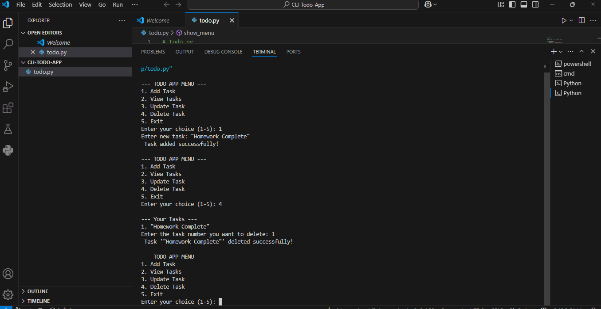

## 📝 CLI Todo App

A simple and interactive Command Line Interface (CLI) Todo application built with Python or OOP(classes & objects).   
Manage your daily tasks easily through a menu-driven interface supporting full CRUD (Create, Read, Update, Delete) operations.

---

## ✨ Features

- ➕ Add Task — Easily add new tasks to your todo list.
- 👀 View Tasks — See all your pending and completed tasks.
- ✏️ Update Task — Modify or correct an existing task.
- 🗑️ Delete Task — Remove tasks you no longer need.
- 🚪 Exit Application — Exit the app anytime smoothly.

---

## 📁 Project Structure

- `todoapp.py` — Main Python file with all functionality

---

## 🧠 How It Works
When you run the app it will show the menu like:
--- TODO APP MENU ---
1. Add Task
2. View Tasks
3. Update Task
4. Delete Task
5. Exit
You simply enter a number (1-5) to perform that action.

---

## 💻 How to Run
1. Clone the repository:
git clone https://github.com/your-username/cli-todo-app.git cd cli-todo-app

2. Run the app:
python todoapp.py

---

📌 Screenshot

---

## Requirements:
- Python 3.x

